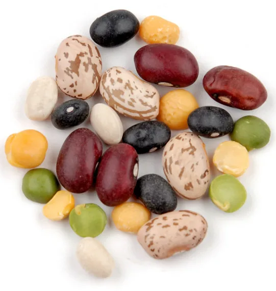
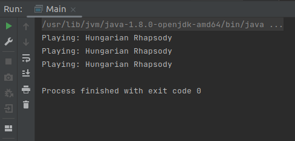

  # Spring_moreBeans_xml
 this is a continuation of the project: Spring_1stBean_xml

 	(https://github.com/abambi-abambi/Spring_1stBean_xml)

 <html>

</html>

**This project work on and with:**

	- OS: Linux (Ubuntu 21.04) 64-bits;
	- IDEA Community Edition;
	- Spring Framework;
	- Maven build tools;
	- Java 8 (JDK 1.8).

 **Just more beans:**

	- pip inside src/main/java/org/example2/Main.java file and see different ways of bean callings;

	- see src/main/resources/applicationContext.xml file to find the Beans.
 <html>

</html>

 ## Launch the project:
 - open the project in IDEA;
 - press alt + shift + F10 and
 - see the result:

 <html>

</html>

~~ ~~ ~~
# A bit of theory

 ## Bean is:

	- a java object;
	- when java object is created via Spring it is named "bean";
	- "bean" is created from a java class (the same as usual java objects).

 ## Work with beans, steps:

	- create a java class (the future bean);
	- create and connect beans via Spring mechanisms (annotations, xml, java code);
	- from now all objects (beans) are taken from the Spring container via context.getBean() method.

 ## Spring dependency injections:

- through the attribute/field directly;

- through the constructor;

- through the setter;

- there are many configurations of injection:
	- scope;
	- factory method and others;
- injections can be made with:
	- .xml-configuration file (old);
	- java annotations + a bit of xml (modern);
	- total configuration via java code (modern); 
- injections can be automated ("autowiring").

**Links**

	"Spring Framework. Урок 4: Инверсия управления. Inversion of Control (IoC)."
	https://www.youtube.com/watch?v=Ns0IxBXDbWw&list=PLAma_mKffTOR5o0WNHnY0mTjKxnCgSXrZ&index=4

	"Spring Framework. Урок 5: Внедрение зависимостей. Dependency Injection (DI). Введение."
	https://www.youtube.com/watch?v=MjnVZgMnTT0&list=PLAma_mKffTOR5o0WNHnY0mTjKxnCgSXrZ&index=8

**Tags**

Spring Framework, Beans, Inversion of Control (IoC), Dependency Injection (DI).